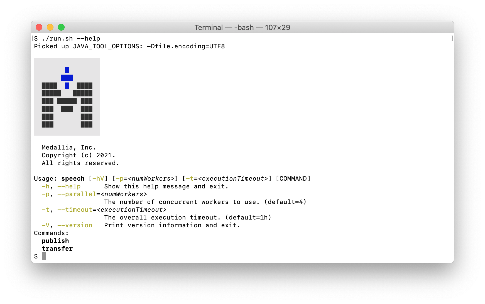
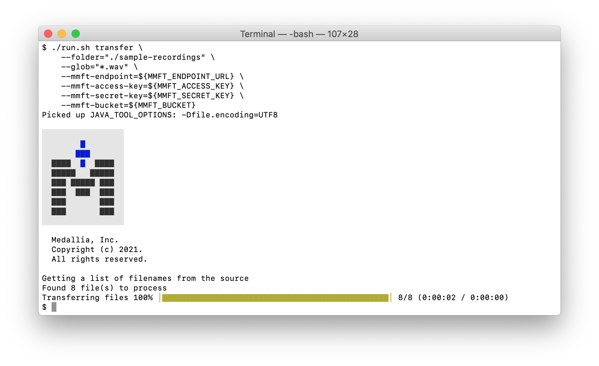
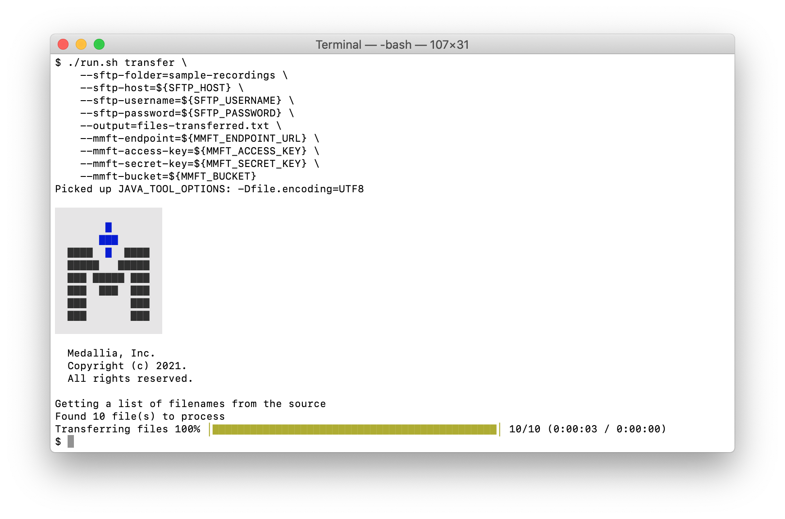
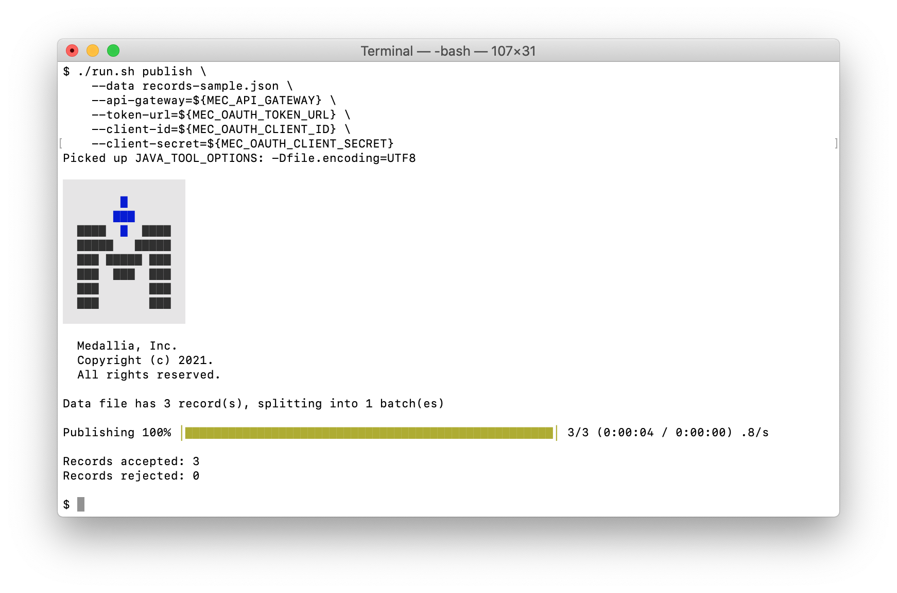

# Medallia Speech API

## Objective

This application is a reference implementation for how to publish voice
recordings and other speech-related data to Medallia Experience Cloud (MEC)
using the Medallia Speech API.

## Theory of Operation

This process occurs in two stages:

1. Transfer the recording file to the Medallia Media File Transfer (MMFT)
   server; and

2. Publish the recording metadata to the Medallia Speech API to begin
   processing.

Both stages can be executed using parallel workers and have a maximum
execution time enforced.

## Compile

This program was written to compile and run using
[AdoptOpenJDK 16](https://adoptopenjdk.net).  Please install and
configure it on your system before proceeding.

Run the following commands:

```
./compile.sh
```

## Usage

The below examples use environment variables to mask sensitive information.
Contact your Medallia representative to obtain the following details
before proceeding:

- The MMFT endpoint
- The MMFT access and secret keys
- The MMFT bucket name
- The MEC OAuth 2.0 client id and secret
- The MEC OAuth 2.0 token URL
- The Medallia Speech API URL via the Medallia API Gateway

### Online Help

Once compiled, run `./run.sh --help` to see the usage screen and common
arguments:



You can further explore each subcommand's help using
`./run.sh [command] --help`, where `[command]` is one of the commands listed
at the bottom of the first usage screen shown:


### Transferring Recordings to MMFT

This application is capable of transferring recordings to MMFT from a source
of either an SFTP or a local directory.

The following shows how to transfer data from a local directory:

```
./run.sh transfer \
    --folder=./sample-recordings \
    --glob="*.wav" \
    --mmft-endpoint=${MMFT_ENDPOINT_URL} \
    --mmft-access-key=${MMFT_ACCESS_KEY} \
    --mmft-secret-key=${MMFT_SECRET_KEY} \
    --mmft-bucket=${MMFT_BUCKET}
```



The following shows how to transfer data from a SFTP source:

```
./run.sh transfer \
    --sftp-folder=sample-recordings \
    --sftp-host=${SFTP_HOST} \
    --sftp-username=${SFTP_USERNAME} \
    --sftp-password=${SFTP_PASSWORD} \
    --output=files-transferred.txt \
    --mmft-endpoint=${MMFT_ENDPOINT_URL} \
    --mmft-access-key=${MMFT_ACCESS_KEY} \
    --mmft-secret-key=${MMFT_SECRET_KEY} \
    --mmft-bucket=${MMFT_BUCKET}
```



### Publishing Metadata to Medallia Speech

The Medallia Speech API accepts metadata in JSON format, but this application
accepts metadata in either JSON or CSV format, converting as needed.

```
./run.sh publish \
    --data=metadata.csv \
    --api-gateway=${MEC_API_GATEWAY} \
    --client-id=${MEC_OAUTH_CLIENT_ID} \
    --client-secret=${MEC_OAUTH_CLIENT_SECRET} \
    --token-url=${MEC_OAUTH_TOKEN_URL}
```



## License

Copyright 2021.  Medallia, Inc.

Licensed under the Apache License, Version 2.0 (the "License"); you may
not use this file except in compliance with the License.  You may obtain
a copy of the License at

    http://www.apache.org/licenses/LICENSE-2.0

Unless required by applicable law or agreed to in writing, software
distributed under the License is distributed on an "AS IS" BASIS,
WITHOUT WARRANTIES OR CONDITIONS OF ANY KIND, either express or implied.
See the License for the specific language governing permissions and
limitations under the License.
